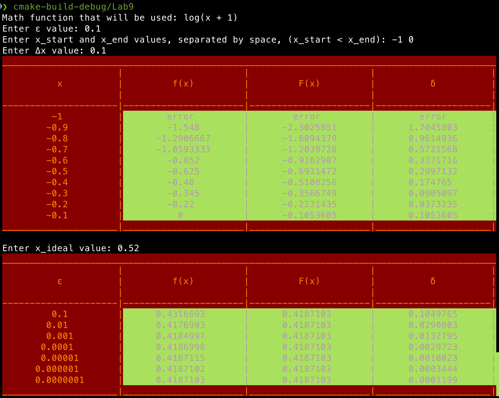

# Как писать библиотеку для лабы 9

## Что происходит?
По сути эта лаба 9 - это просто лаба 4 с подключением _динамических библиотек_. 
Вам нужно написать _основную программу_ и _библиотеку_. Причем ваша программа должна работать не только с вашей библиотекой,
но и с библиотеками всех, кто придерживается тех же стандартов, что и вы (например, этому).

### Цвета
В ней есть **важный момент**, не прописанный в самом задании... Ваша таблица должна красится в два цвета:
в ваш цвет и в цвет того, чью библиотеку вы подключили. Это должно выглядеть так:



Тут красный - это цвет того, кто писал **основную программу**, а зеленый - того, кто писал **библиотеку**.

### В чем проблема лабы?
Сложность лабы в том, чтобы договориться и сделать одинаковые библиотеки. Для этого и нужен этот файлик. По заданию
в вашем коде должна быть возможность **поменять только один файлик `.dylib` (MacOS) или `.dll` (Windows)** и все должно работать.

### Как называть библиотеку
Для совместимости с нашими библиотеками ваша библиотека должна назваться точно также. Название, которе мы приняли -
`func_eval`. Сам файл с библиотекой должен называться `libfunc_eval.dylib` для MacOS и `libfunc_eval.dll` для Windows.

### Заголовок
Код ниже - это то, как **обязан** выглядеть ваш файл заголовка. Он должен называться именно `func_eval.h`.

```c++
#pragma once
#ifndef FUNC_EVAL_LIBRARY_H
#define FUNC_EVAL_LIBRARY_H

#ifdef __cplusplus
extern "C" {
#endif

    typedef struct {
        int text;
        int background;
    } Color;

    typedef enum {
        EVAL_SUCCESS,
        EVAL_ERROR
    } EvalStatus;

    typedef enum {
        TABLE_1_ROW,
        TABLE_2_ROW
    } RowType;

    char *get_function_name();

    double generate_and_print_table_row(
        double x,
        double epsilon,
        double a,
        RowType row_type,
        Color local_color,
        void (*print_table_row)(
            EvalStatus status,
            double value1, double value2, double value3, double value4,
            Color local_color, Color external_color
            )
    );

#ifdef __cplusplus
}
#endif

#endif // FUNC_EVAL_LIBRARY_H
```

Далее по сути идет описание того, что происходит в этом заголовке.

# Типы

## `Color`
Структура, которая содержит в себе значения цветов в 256-цветовом формате ANSI. В ней есть два поля:
- `text` - цвет текста, число от 0 до 255
- `background` - цвет фона, число от 0 до 255

### Как пользоваться цветами
Цвет задается через **ANSI escape-коды**:

```c++
\033[38;5;<n>m // цвет текста
\033[48;5;<n>m // цвет фона
\033[0m // сброс всех цветов
```

Где \<n\> — код от 0 до 255. Цвета можно посмотреть, например, [тут](https://www.ditig.com/256-colors-cheat-sheet).

После ввода этих кодов в консоль, ее цвета поменяются.

Например:

```c++
std::cout << "\033[38;5;196m\033[48;5;34mКрасный текст на зеленом фоне\033[0m" << std::endl;
```

#### Для Windows консоли
В лабораторной работе 5 для работы с цветом использовался `WinAPI`. 
Тут мы используем **ANSI коды** и это не поддерживается большинством терминалов Windows.
Поэтому если вы пишете код для Windows, для того чтобы ANSI коды работали, вам надо сначала включить
режим виртуального терминала (Virtual Terminal).

Например, это можно сделать с помощью такой функции:

```c++
void enableVirtualTerminal() {
    HANDLE hOut = GetStdHandle(STD_OUTPUT_HANDLE);
    if (hOut == INVALID_HANDLE_VALUE) {
        return;
    }

    DWORD dwMode = 0;
    if (!GetConsoleMode(hOut, &dwMode)) {
        return;
    }

    dwMode |= ENABLE_VIRTUAL_TERMINAL_PROCESSING;
    SetConsoleMode(hOut, dwMode);
}
```

После ее вызова в программе, ANSI escape-коды должны работать.

## `EvalStatus`
Указывает на статус вычислений. Это enum, которое может принимать два значения:
- `EVAL_SUCCESS` - вычисления прошли успешно
- `EVAL_ERROR` - произошла ошибка при вычислениях

Это можно использовать на свое усмотрение, но в основном нужно для того, чтобы говорить `print_table_row`,
есть ли среди вычислений нежелательные значения типа `nan` или `inf`.

_Например, `print_table_row` может среагировать на ошибку, заполняя все ячейки строки таблицы словом `error`._

## `RowType`
Это enum, имеющий два значения: `TABLE_1_ROW` и `TABLE_2_ROW`.
Эти значения соответствуют двум таблицам из задания лабы. То есть в первом столбце строки таблицы при
`TABLE_1_ROW` будет значение `x`, а при `TABLE_2_ROW` - `epsilon`.

# Функции

# `get_function_name`
Функция, которая возвращает строковое представление математической функции из вашего варианта. Это нужно по заданию.

### Пример
```c++
char *get_function_name() {
    return "x*cos(3*x)";
}
```

🗿🗿🗿

# `generate_and_print_table_row`
Это главная функция из вашей библиотеки, только ее будет вызывать основная программа.

## Описание
У этой функции есть две задачи:
1. Для заданных `x` и `epsilon` вычислить значения ряда и математической функции. Тут все, как и в лабе 4.
2. Вызвать функцию `print_table_row`, передав ей результаты вычислений.

## Параметры
### `double x`
Значение, для которого будет вычисляться ряд. Из лабы 4.

### `double epsilon`
Точность вычислений. Из лабы 4.

### `double a`
Параметр, который требуется только в некоторых вариантах. Для совместимости, естественно,
он должен быть в сигнатуре функции.

### `RowType row_type`
Тип строки таблицы. По сути он нужен, чтобы `generate_and_print_table_row` знал, какие значения после вычислений
нужно передавать в `print_table_row`.

#### Пример
Предполагается, что внутри `generate_and_print_table_row` будет что-то такое:
```c++
double first_column_value;
if (row_type == TABLE_1_ROW) {
    first_column_value = x;
} else {
    first_column_value = epsilon;
}
```

### `Color local_color`
Цвет пользователя, который пишет _основную программу_ и вызывает `generate_and_print_table_row` из библиотеки.

### `void (*print_table_row)`
Как понятно из названия, это функция, которая будет выводить строку таблицы. Ее параметры:
- `EvalStatus status` - статус вычислений.
- `value1`, `value2`, `value3`, `value4` - то, что, собственно, будет печататься в таблице.
  - Напоминание. В таблицах из задания аргументы должны идти в таком порядке:
    - 1 - Epsilon или x 
    - 2 - Значение рядной функции 
    - 3 - Значение математической библиотечной функции 
    - 4 - Delta
- `Color local_color` - цвет того, кто использует библиотеку.
- `Color external_color` - цвет того, кто написал библиотеку.

В реализации этой функции надо учесть, что по заданию нужно,
чтобы первый столбец этой таблицы выводился с цветом `local_color`, а остальные три с `external_color`.
